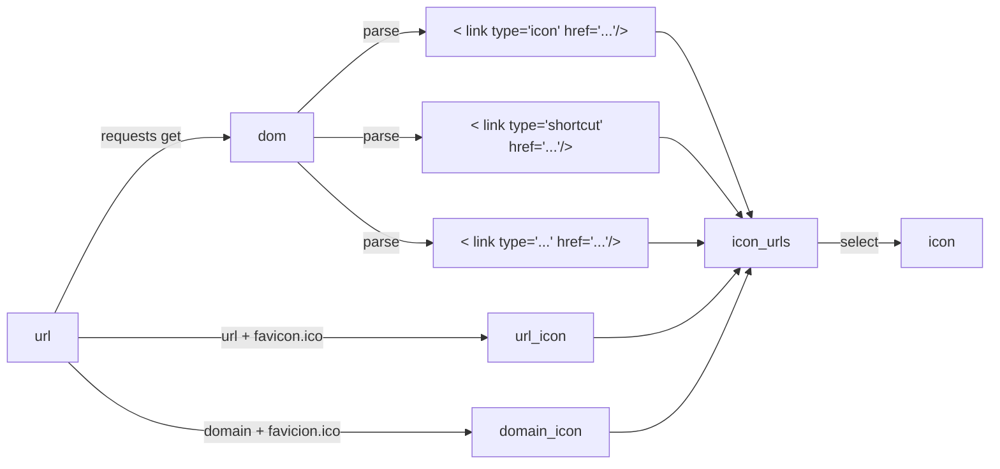

自动解析网站图标，并以跨域的方式代理该图标

## 使用例子

http://favicon.com/http://baidu.com 

```html

```

## 流程图



## 部署

### 克隆代码
```bash
git clone https://github.com/jawide/favicon
```

### 使用docker-compose一键部署
```bash
docker-compose up -d
```